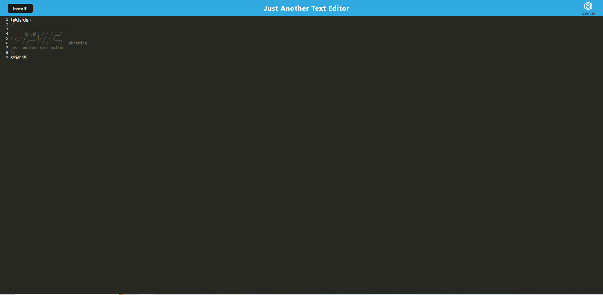

# Text Editor

## Purpose
An application that is a text editor that works in browser. 

## Installation

After cloning the repository run `npm install` to install all the needed packages from the package.json file. 

## Built With
* Webpack
* IndexedDB
* Workbox
* JavaScript
* HTML
* CSS

## Usage
Run `npm start` to start the server. Then go to http://localhost:3001 to view the application.

Link to deployed website: https://fathomless-lowlands-62440.herokuapp.com/

## Contribution
Made by Cy Howard
